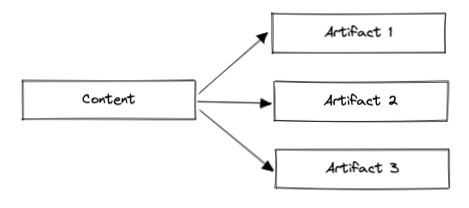
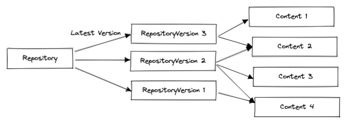
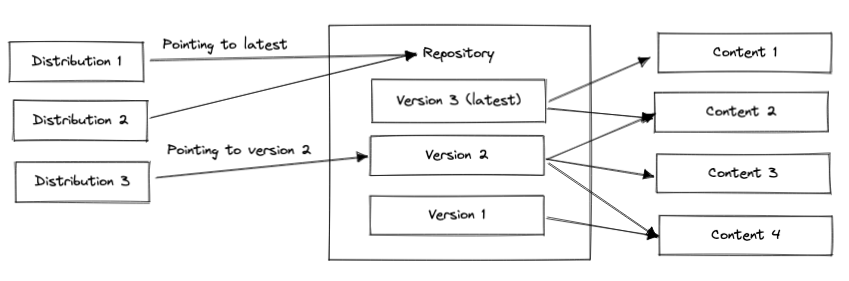
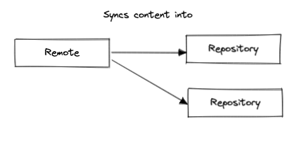
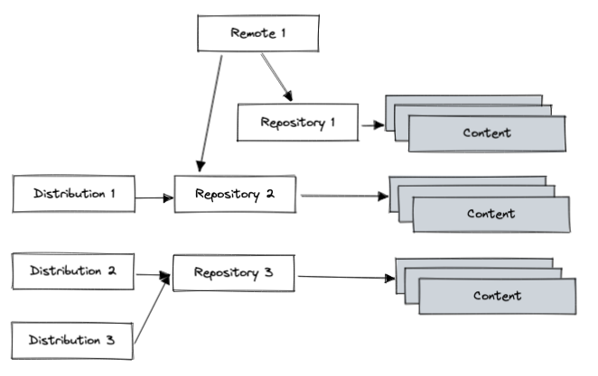
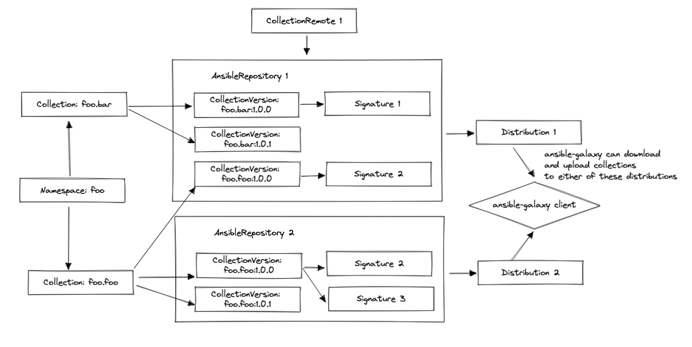
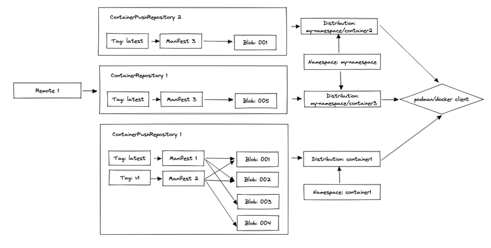

# Data Models

This section will go through the most important models in the pulp ecosystem. This is not a comprehensive tour of all the data models in galaxy ng. For that, your best option is to read through the model files in pulpcore and it's plugins.

## Generic Pulp Objects

Pulpcore provides the following generic data models that are meant to be extended by plugins to provide support for specific content types. For example, the pulp ansible plugin extends Content to create CollectionVersions and Repository to create AnsibleRepository (more on this in the pulp ansible section). While these generic models are never used directly, understanding what they do and their limitations is crucial to understanding how the pulp plugins work.

### Artifact

Binary objects that are downloaded by clients. This is the actual software (collection tarballs, role tarballs, container image binaries, python wheels) that pulp stores.

### Content

This represents the software that's stored in pulp (ansible collections, container image layers, python packages, RPMs etc). This model stores metadata about the content that is extracted from the content artifact and is immutable.

Content ultimately references one or more artifacts, however the artifact may not actually be present on the system. Pulp has support for on demand syncing, which means that the content isn't downloaded from a remote until it's actually needed.

**Example**

<!-- Diagram source can be found in diagrams/model-diagrams.excalidraw and can be edited on https://excalidraw.com/ -->

### Repository

A big bucket of content. Think of this like a folder that has a set of collections (or any other pulp content) in it. Repositories store pointers to content, not the actual content itself.

Repositories are versioned and repository versions are immutable. What this means is that whenever content is added or removed from a repository a new repository version is created that references the list of changes that happened on the repository. This is similar to how git works where code in a git repository is a long list of commits that reference changes that were made to the code over time. Versions allow for repositories to be rolled back to a previous state

The repository object in the database points to whatever the latest repository version is, however content can be referenced in any version of a repository, not just the latest version.

**Example**

<!-- Diagram source can be found in diagrams/model-diagrams.excalidraw and can be edited on https://excalidraw.com/ -->

### Distribution

A pointer to a repository. Whenever clients consume content from pulp, they access the content in repositories via distributions. Each distribution points to one repository, but repositories can have multiple distributions. Think of this like a URL for a repository. This is how content in repositories is referenced. Without a distribution, content in pulp is inaccessible to clients (such as ansible-galaxy and podman).

In most cases distributions just point to the latest repository version of a repository, however they can be updated to point to a specific version.

The actual URL/path that is used to reference the distribution is `base_path`.

**Example**

Distribution 1 and 2 point to the latest version, which contains content 1 and 2, so this set of content will be available to any clients pulling content from either of these distribution's base_path.

Content 2, 3, 4 will be available from Distribution 3's base path since it points to version 2.

<!-- Diagram source can be found in diagrams/model-diagrams.excalidraw and can be edited on https://excalidraw.com/ -->

### Remote

This defines the information that is required to connect to a remote server to download a set of content into pulp. This includes a server URL, authentication credentials to login to the server, a set of content to sync from the server and other miscellaneous information for connecting to the server.

**Example**

<!-- Diagram source can be found in diagrams/model-diagrams.excalidraw and can be edited on https://excalidraw.com/ -->

### Putting it all together

An example system might look like this (note, repository versions and artifacts have been omitted for simplicity). In this example:

- Remote 1 is syncing content into Repository 1 and 2.
- Content in Repository 1 will be inaccessible to clients because it has no distribution attached to it.
- Content in Repository 3 will be accessible from distributions 2 and 3, but content can only be added to the repo by manually uploading it, since there is no remote attached to the repository.

<!-- Diagram source can be found in diagrams/model-diagrams.excalidraw and can be edited on https://excalidraw.com/ -->

## Pulp Ansible Content Model

Pulp ansible provides the following models:

- Content
    - Role: Ansible role. These aren't supported in galaxy ng at the moment.
    - CollectionVersion: Collections can have multiple versions and the content that actually gets installed by clients is a collection version.
    - CollectionVersionSignature: Signatures that can optionally be attached to collections.
    - AnsibleCollectionDeprecated: Indicates if a collection is deprecated or not.
- Remote
    - RoleRemote: Server that supports the v1 galaxy API. Currently unused.
    - CollectionRemote: Server that supports either the v2 or v3 galaxy API.
    - GitRemote: Git server that contains a collection as a git repository. Currently unused.
- Repository
    - AnsibleRepository: contains all the ansible content types listed above.
- Distribution
    - AnsibleDistrbution

Additionally Pulp Ansible defines the following models that don't extend any of the pulp base classes:

- Collection: This is used to group CollectionVersions by namespace and name.
- Namespace: Contains information about the publisher of a collection. This also defines who can publish collections within a given namespace.

**Example**

<!-- Diagram source can be found in diagrams/model-diagrams.excalidraw and can be edited on https://excalidraw.com/ -->

## Pulp Container Content Model

The pulp container data model is a little bit counter-intuitive and bears some additional explanation. For this example lets assume we have a container registry running on my-registry.example.com with the following containers:

- container1:latest
- container1:v1
- my-namespace/container2:latest
- my-namespace/container3:latest

One might assume that pulp container users a similar data model as pulp ansible where container tags (container1:latest, container1:v1 etc.) are modeled as content that link to containers (container1, container2 etc) which are linked to container namespaces (my-namespace). This is **NOT** how pulp container works. Under the hood, containers are a little bit more complicated then collections.

For starters, a container isn't comprised of a single artifact the same way collections are. Rather they are a set of image layers that get layered on top of each other to form an image. Container images are set up this way because they can get very large, and layering them allows for binaries to be reused between containers. Going back to our example container1:latest might have the following layers

- 001
- 002
- 003

and container1:v2 might have:

- 001
- 002
- 004

With this setup, latest and v1 can save a lot of space by sharing layers 001 and 002.

With all of this in mind, pulp container defines the following models (not, some content types are omitted for simplicity):

- Content
    - Blob: container image layer
    - Manifest: list of image layers for a container
    - Tag: human readable pointer to a Manifest
- Remote
    - ContainerRemote
- Repository
    - ContainerRepository: repository for containers synced from a remote.
    - ContainerPushRepository: repository for containers pushed locally with podman or docker push.
- Distribution
    - ContainerDistrbution

With this setup, the containers in our example earlier would look like:

<!-- Diagram source can be found in diagrams/model-diagrams.excalidraw and can be edited on https://excalidraw.com/ -->

