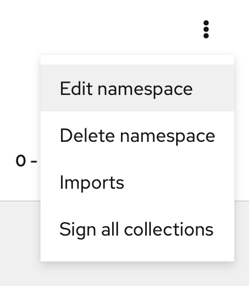
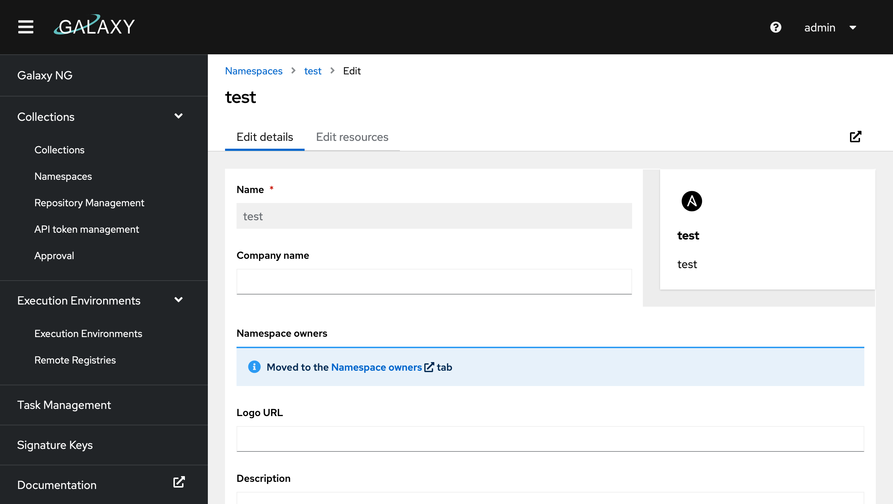
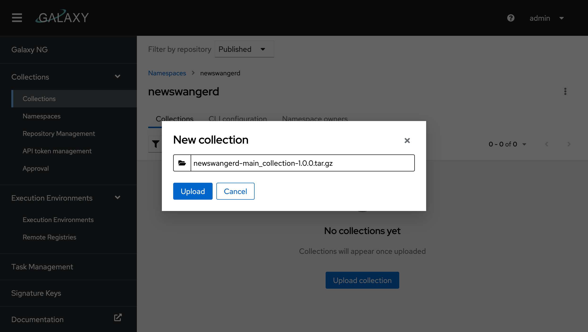
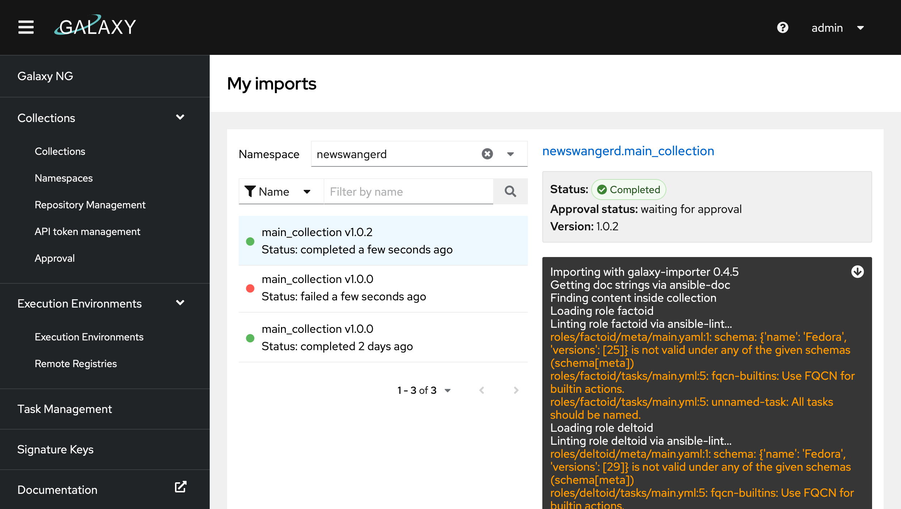
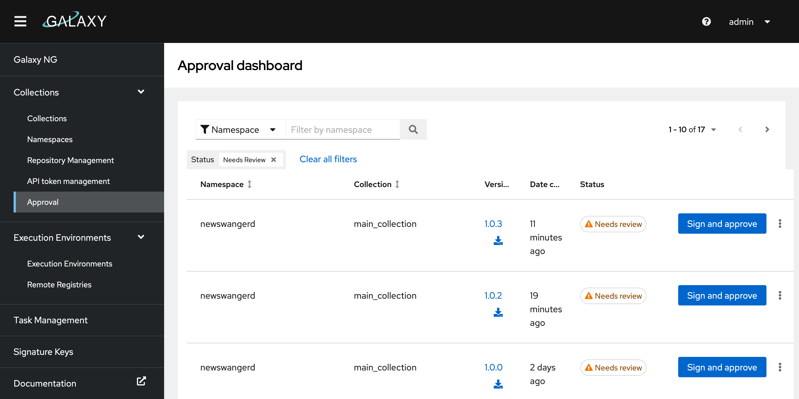
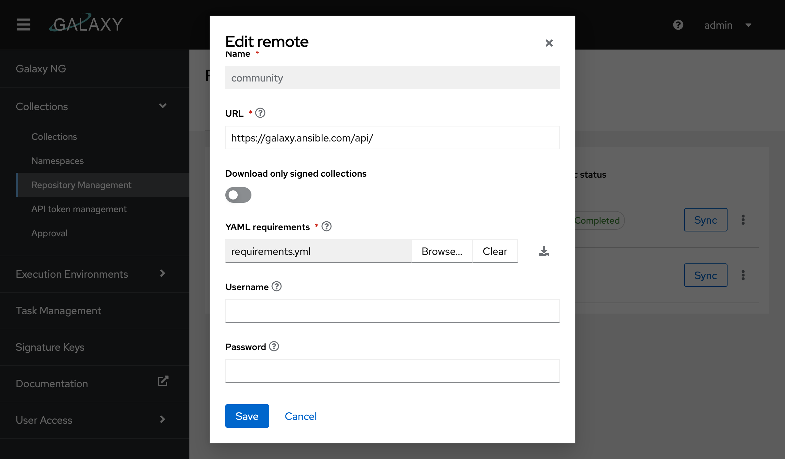
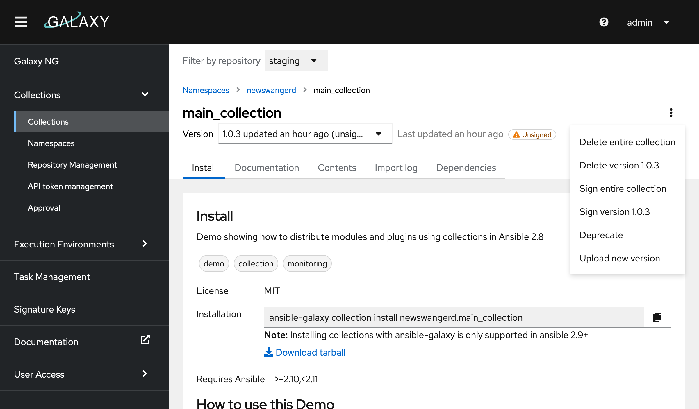

# Collections

This guide is intended to walk you through the basics of managing collections in Galaxy NG. For information on writing and using collections within the broader ansible ecosystem, please refer to the documentation for:
- [Using collections](https://docs.ansible.com/ansible/latest/dev_guide/developing_collections.html#developing-collections)
- [Developing collections](https://docs.ansible.com/ansible/latest/dev_guide/developing_collections.html#developing-collections)

## Namespaces

Collection namespaces typically contain information about the publisher of a specific collection. To view the namespaces in the system, navigate to the namespaces page under Collections > Namespaces in the navigation menu. From here you can view the namespaces that you have access to manage under "My namespaces", as well as all of the namespaces under "All".

New namespaces can be created from here. To create a namespace, click the "create" button and pick a new namespace name. 

To edit a namespace, select the namespace from "My namespaces" and  click the "Edit namespace" button from the kebab in the header. 



From here you can add links to documentation, manage user access, set a description and write a readme for your namespace from the Edit Resources tab.



### Permissions

Users can be given access to manage a namespace by going to the "Namespace owners" tab and selecting one or more groups to assign to the namespace. Each group can be given a role with customized sets of permissions. To see more information about creating roles, visit the RBAC guide.

## Uploading Collections

Before uploading a collection, you must create a namespace that matches the collections namespace. For example if I have an artifact named `foo-bar-1.2.3.tar.gz`, I need to create the `foo` namespace before it can be uploaded.

Once a collection is uploaded, it may not appear on the search page right away. See [Approval](#approval) for details.

### Via the UI

Find your namespace under "My namespaces" on the namespaces page. Click "Upload collection" and select the tarball you want to upload from your computer and click "upload".



This will kick off a collection import and you'll be redirected to the import log. If there are any errors with the collection, this page will let you know.



You can view previous imports for a namespace by selecting "Imports" from the kebab on the namespaces page.

### Via the CLI

Before you can do this you need to [configure the ansible-galaxy CLI to connect to Galaxy](#configuring-the-ansible-galaxy-cli).

To upload a collection run the following `ansible-galaxy collection publish` command:

```shell
$ ansible-galaxy collection publish newswangerd-main_collection-1.0.3.tar.gz
Publishing collection artifact '/Users/dnewswan/code/collections/collection_demo/collection_demo/newswangerd-main_collection-1.0.3.tar.gz' to dev http://localhost:5001/api/galaxy/
Collection has been published to the Galaxy server dev http://localhost:5001/api/galaxy/
Waiting until Galaxy import task http://localhost:5001/api/galaxy/v3/imports/collections/e2dda51b-d176-43da-a2b7-86c87013197a/ has completed
Collection has been successfully published and imported to the Galaxy server dev http://localhost:5001/api/galaxy/
```

### Approval

Once a collection is uploaded, it will either end up in the Published repository, where it will be available for download, or the staging repository where it needs to be approved first depending on what you have configured for [GALAXY_REQUIRE_CONTENT_APPROVAL](/galaxy_ng/config/options#galaxy).

If approval is required, click the "Collections > Approval" link in the navigation menu. This will give you a list of newly uploaded collections to review. If signing is enabled, you will also be promted to sign the collection.

!!! note
    You will need the "Modify Ansible repo content" permission to access the Approval dashboard. Make sure you have an account with the appropriate role.



## Installing Collections from Galaxy NG

Before you can do this you need to [configure the ansible-galaxy CLI to connect to Galaxy](#configuring-the-ansible-galaxy-cli).

Once you have your CLI configured, simply run:

```shell
ansible-galaxy collection install namespace.name:1.0.3
```

You can copy the command to install a collection by finding your collection under Collections > Collection:


## Syncing Collections

Collections can be synced from galaxy.ansible.com or console.redhat.com (with an AAP subscription from Red Hat). For information on syncing certified collections, refer to the Red Hat product documentation.

To sync from galaxy navigate to the Collections > Repository Management page and select the Remote page. Select "Edit" from the kebab on the "community" remote and upload a requirements.yaml file.



A requirements file looks something like this. You can use any [python version range specifier](https://peps.python.org/pep-0440/#version-specifiers) to select a range of collection versions you would like to sync.

```yaml
collections:
    # sync all versions of a collection
  - name: amazon.aws

    # sync one version of a collection
  - name: community.general
    version: 1.0.0

    # sync a list of specific versions
  - name: community.aws
    version: "==1.1.0,==1.2.0"

    # sync all versions later than a specific version
  - name: community.asa
    version: ">=1.0.0"

    # include a specific older version of community.asa
  - name: community.asa
    version: "=0.4.0"
```

Once you have your requirements file uploaded you can click "sync" to kick the job off. To view the status of the sync while its running, locate it in the Tasks tab.

## Deleting and Deprecating Collections

Collections can deleted or deprecated by selecting a collection from "Collections > Collection". Deleting a collection will permanently remove it from the system. Before a collection can be deleted, any collections that depend on it must be deleted first.

Deprecation will mark the collection as deprecated and hide it from the collection search page, but will still make it available for download. This is useful for communicating that a collection shouldn't be used anymore, without making it inaccessible for projects that may still rely on it.



## Configuring the ansible-galaxy CLI

Check out the [ansible-galaxy CLI docs](https://docs.ansible.com/ansible/latest/user_guide/collections_using.html#configuring-the-ansible-galaxy-client) for more in depth information on configurating the CLI.

To configure the CLI to work with Galaxy NG you'll need to configure one server for each repository you wish to download from as well as credentials for your user account. The list of available repositories can be viewed from the "Collections > Repository management" page.

You can either user your username and password for authentication or get a token from "Collections > API token management".

A full configuration for all the repositories will look something like this:

```cfg title="~/.ansible.cfg"
[galaxy]
server_list = publishd, certified, community, staging, rejected

[galaxy_server.published]
url=http://localhost:5001/api/galaxy/
username=admin
password=admin

[galaxy_server.certified]
url=http://localhost:5001/api/galaxy/content/certified/
token=0c69a0dc89ef555b9a4870270f18f8772d116efa

[galaxy_server.community]
url=http://localhost:5001/api/galaxy/content/community/
token=0c69a0dc89ef555b9a4870270f18f8772d116efa

[galaxy_server.staging]
url=http://localhost:5001/api/galaxy/content/staging/
token=0c69a0dc89ef555b9a4870270f18f8772d116efa

[galaxy_server.rejected]
url=http://localhost:5001/api/galaxy/content/rejected/
token=0c69a0dc89ef555b9a4870270f18f8772d116efa
```

Not all of these are required. If you don't have any collections synced from galaxy.ansible.com or console.redhat.com, you may only need to configure the `published` repository. `staging` and `rejected` won't be useful to most users.

### Configure upload repositories

To upload a collection you have to have one of two things configured in your ansible.cfg file:

- The `published` repository at `/api/galaxy/` (note `/api/galaxy/content/published/` won't work). This will allow uploading to any namespace.
- One or more `inbound-<NAMESPACE>` repositories. This will allow you to upload collections for a single namespace. The url for this can be copied from the CLI configuration tab on "Collections > Namespaces".

    Example for the `testing` namespace:
    ```
    [galaxy_server.inbound-testing]
    url=http://localhost:5001/api/galaxy/content/inbound-testing/
    token=0c69a0dc89ef555b9a4870270f18f8772d116efa
    ```
