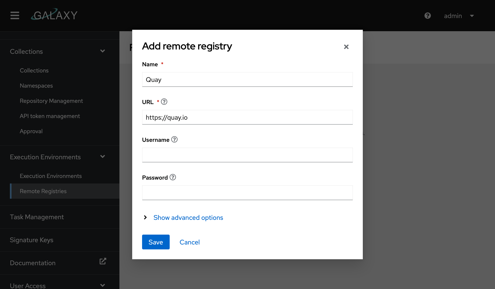
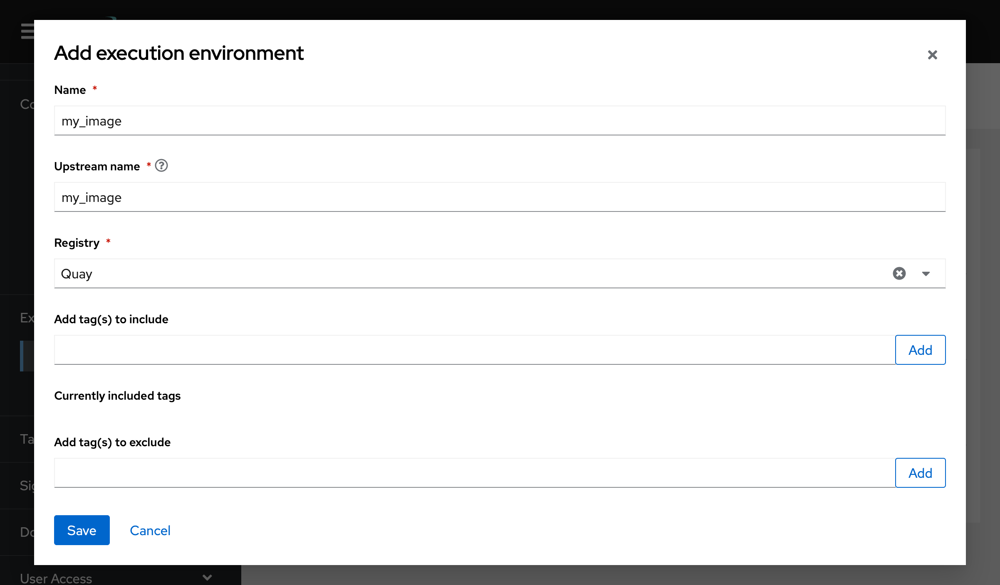

# Execution Environments

For information on how to use execution environments, please check out [Getting started with execution environments](https://docs.ansible.com/ansible/latest/getting_started_ee/index.html).

Galaxy NG provides a container registry for pushing container images. It functions just like any other container registry and can be accessed with all the standardized container tools.

## Pushing Images

!!! note
    Pushing images requires permissions.

1. Authenticate with the galaxy registry: `podman login localhost:5001`
2. Tag or build an image with the host that galaxy is running on: `podman image tag my_ee:latest localhost:5001/my_ee:latest`
3. Push the image: `podman image push localhost:5001/my_ee:latest`

## Downloading Images

1. Authenticate with the galaxy registry: `podman login localhost:5001`
2. Pull the image: `podman image pull localhost:5001/my_ee:latest`

## Syncing Images

To sync an image from a remote container registry, you need to configure a remote under "Execution Environments > Remote Registries"

From here put in the URL to the registry you wish to download from and add any required credentials to authenticate. Some container registries are fairly aggressive with their rate limiting, so you may want to set a rate limit under "advanced options".

Once your remote is configured go to "Execution Environments > Execution Environments" and click "Add execution environment" in the page header.

Select the registry you wish to pull from. The "name" field is the name that the image will show up as on your local registry. The "Upstream name" field is the name of the image on the remote server. For example if I set upstream name to "alpine" and name to "local/alpine", the alpine image will be downloaded from the remote and renamed to local/alpine.

We recommend setting a list of tags to include or exclude. Syncing images with lots of tags is time consuming and can use a lot of disk space.

## Namespaces

Namespaces are created automatically on image pushes. If no namespace is found in the container name (ie for a container named `my_ee`), a namespace will be created that's the same as the container name (in this case `my_ee`). Namespaces can be specified by prepending them with a slash (ex `my_namespace/my_ee`). This will create a namespace called `my_namespace`.

!!! warning
    If you don't specify a namespace on your image, the namespace the automatically created namespace will only be able to accommodate one image. For example if you create an image named `foo`, you can't create another image named `foo/my_ee`.

## Managing Images

!!! Note
    All of these actions require permissions.

### Adding a Readme

A readme can be added to any image in galaxy by going to "Execution Environments > Execution Environments" selecting an image and then clicking "Add readme". Readmes are not automatically synced from remote registries, as the container registry API spec doesn't support them natively and these are implemented differently by each container registry.

### Tagging Images

Image tags can be added and removed via the UI by going to "Execution Environments > Execution Environments", selecting an image and navigating to the "Images" tab. To edit tags on an image select the option from the dropdown.

### Deleting Images

Image tags can be deleted via the UI by going to "Execution Environments > Execution Environments", selecting an image and navigating to the "Images" tab. To delete an image select the option from the dropdown.

### Permissions

Permissions for Execution Environments are stored on the EE's namespace object. This means that a user that's given access to the `foo/bar` image will also be granted permission to manage and create images under the `foo` namespace.

Users can be assigned permissions to manage EE's in a namespace by going to "Execution Environments > Execution Environments", selecting an image and navigating to the "Owners" tab. From here groups can be granted roles on the EE's namespace.

!!! note
    The use who creates the namespace originally will automatically receive all permissions on the namespace. These currently cannot be revoked.
